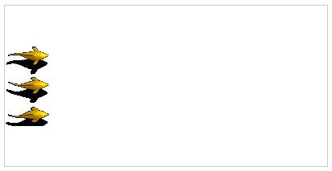
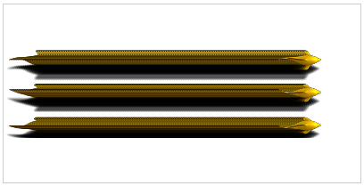
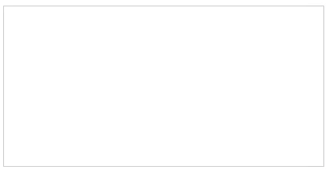
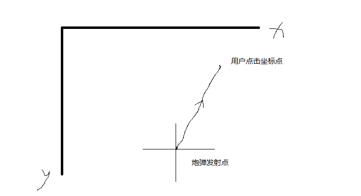
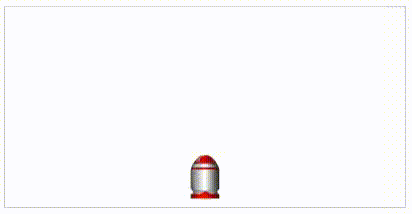

一款基于 Canvas 制作的小游戏——捕鱼达人。

# 技术基础

- Canvas 基础
- 初中几何知识

## Canvas 回顾

canvas 主要有两个对象：

- [HTMLCanvasElement](https://developer.mozilla.org/zh-CN/docs/Web/API/HTMLCanvasElement)
- [CanvasRenderingContext2D](https://developer.mozilla.org/zh-CN/docs/Web/API/CanvasRenderingContext2D)

### canvas

```javascript
<canvas id="cvs" width="600" height="600"></canvas>

const canvas = document.getElementById('cvs')
```

主要属性：

- height
- width

主要方法：

- getContext()
- toDataUrl()
- toBlob()

### context

```javascript
<canvas id="cvs" width="600" height="600"></canvas>

const canvas = document.getElementById('cvs')
const ctx = canvas.getContext('2d')
```

主要属性：

- font：字体
- fillStyle：填充颜色

主要方法：

- clearRect()：清楚画布
- fillText()：填充文本
- arc()：画弧
- fill()：填充区域
- stroke()：描边路径
- translate()：平移
- scale()：缩放
- rotate()：旋转
- [save()](https://developer.mozilla.org/zh-CN/docs/Web/API/CanvasRenderingContext2D/save)：使用栈保存当前的绘画样式状态
- [restore()](https://developer.mozilla.org/zh-CN/docs/Web/API/CanvasRenderingContext2D/restore)：恢复到最近的绘制样式状态
- [drawImage()](https://developer.mozilla.org/zh-CN/docs/Web/API/CanvasRenderingContext2D/drawImage)：**关键方法**

## 初中几何


知识点：

- 弧度范围：0 ~ 2 * PI
- 角度范围：0 ～ 360
- PI = 180

# 热身练习


```javascript
<canvas id="cvs" width="800" height="800"></canvas>

<script>
  const canvas = document.getElementById('cvs');
  const ctx = canvas.getContext('2d');

  const r = 300;
  const cX = 400;
  const cY = 400;
  const A = 30;

  initCircular(ctx);
  initDot(ctx);

  for (let i = 0; i < 12; i++) {
    const degree = i * A;
    const angle = (degree / 180) * Math.PI;
    const x = cX + r * Math.cos(angle);
    const y = cY + r * Math.sin(angle);
    drawScale(ctx, x, y, angle + Math.PI / 2);

    const x2 = cX + (r - 60) * Math.cos(angle);
    const y2 = cY + (r - 60) * Math.sin(angle);
    drawText(ctx, x2, y2, i + 3);
  }

  function initCircular(ctx) {
    ctx.save();
    ctx.beginPath();
    ctx.arc(cX, cY, r, 0, 2 * Math.PI);
    ctx.lineWidth = 2;
    ctx.fillStyle = '#555';
    ctx.stroke();
    ctx.restore();
  }

  function initDot(ctx) {
    ctx.save();
    ctx.beginPath();
    ctx.arc(cX, cY, 5, 0, 2 * Math.PI);
    ctx.fillStyle = '#00';
    ctx.fill();
    ctx.restore();
  }

  function drawScale(ctx, x, y, rotate) {
    ctx.save();
    ctx.translate(x, y);
    ctx.rotate(rotate);
    ctx.fillRect(-5 / 2, 0, 5, 30);
    ctx.restore();
  }

  function drawText(ctx, x, y, text) {
    ctx.save();
    ctx.translate(x, y);
    ctx.font = '30px Arial';
    ctx.textBaseline = 'top';
    ctx.fillStyle = '#555';
    if (text > 12) {
      text -= 12;
    }
    if (text > 9) {
      ctx.fillText(text, -15, -15);
    } else {
      ctx.fillText(text, -7.5, -15);
    }
    ctx.restore();
  }
</script>
```

# 游戏实战

有了前面的基础铺垫，接下来进入捕鱼游戏实战环节。

## 游戏设计

本游戏主要是通过发射炮弹去攻击鱼，鱼有一定几率致死。在鱼死后，会得到分值。

游戏中共有 7 种类型的炮弹，和 5 种类型的鱼。

**先介绍下每种类型的鱼的得分。**

第 1 种类型的鱼得分是 10，第 2 种类型的鱼得分是 20，依次类推，第 5 种类型的鱼得分是 50。

|种类|分值|
|-|-|
|第1种|10|
|第2种|20|
|第3种|30|
|第4种|40|
|第5种|50|

**再介绍下每种炮弹打不同类型的鱼，致死的概率。**

1. 我们设置定第 1 种炮弹攻击力是 10，第 2 种炮弹攻击力是 20，依次类推，第 7 种炮弹攻击力是 70。公式： `10 * n`

2. 我们设置定第 1 种鱼血量是 10，第 2 种鱼血量是 30，依次类推，第 5 种鱼血量是 90。公式： `10 + 20 * (n - 1)`

3. 我们以鱼的血量为分母，炮弹的攻击力为分子，可以得到一个数值。这个值，作为鱼的死亡率。

4. 设炮弹的类型为m，鱼的类型为n，即鱼的死亡率为：`10 * m / 10 + 20 * (n - 1)`。

**其他**

按照正常的逻辑，每次发生炮弹是需要扣除一定的分值。初始有一个分值，每次发射一颗炮弹，会减掉一定的分值，而打中鱼会增加得分。最后得分为零时，游戏结束。

不过这里我们仅做一个简单版的游戏，所以发射炮弹不扣分。初始分值也设为零，打中鱼会增加得分。

## 游戏图形

游戏中的模型不多，只有几种，都是图片画到 Canvas 上的。

首先是背景，比较简单。由于不需要动，我们直接用做 Canvas 的背景，使用 CSS 的 background 就行。

```html
<style> 
    #cvs {
        background-image: url('../images/game_bg_2_hd.jpg');
    }
</style>

<body>
    <canvas id="c1" width="800" height="600"></canvas>
</body>
```

然后我们讲下鱼怎么画。其实也不难，核心就行 drawImage 这个函数。

```html
<style> 
    #cvs {
        background-image: url('../images/game_bg_2_hd.jpg');
    }
</style>

<body>
    <canvas id="c1" width="800" height="600"></canvas>

    <script>
        const canvas = document.getElementById('cvs')
        const ctx = canvas.getContext('2d')

        const fishWidth = 200
        const fishHeight = 100
        const sx = 0
        const sy = 0
        const dx = 100
        const dy = 100
        const img = new Image()
        img.src = './fish.png'
        img.onload	= function () {
            ctx.drawImage(img, sx, sy, fishWidth, fishHeight, dx, dy, fishWidth, fishHeight)
        }
	  </script>
</body>
```



## Canvas 动画

动画的本质是图片的快速切换，一般来说每秒 24 帧，我们就会觉得是一个连贯的动画了。当然帧率越高，越稳定，效果越好。

为了实现刷新网页，我们这里提供三种方式。

- setTimeout()：可以实现循环，可以调整帧率，但帧率可能会不稳定
- setInterval()：可以实现循环，可以调整帧率，但帧率可能会不稳定
- requestAnimationFrame()：可以实现循环，帧率通常是每秒60次，由系统来决定回调函数的执行时机

这里我们采用 requestAnimationFrame 来实现动画，使用示例如下：

```js
function animation() {
    ctx.drawImage(img, 0, 0, 200, 100, 0, 50, 200, 100)
    
    requestAnimationFrame(animation)
}

requestAnimationFrame(animation)
```

## 游戏图形变换

现在我们可以循环执行 animation 函数了，但是想让网页动起来，还需要改变 Canvas 的内容。

为了改变图片在 Canvas 上面的位置，我们可以使用 translate 平移方法。

```js
let x = 0

function animation() {
    x += 2
    ctx.drawImage(img, 0, 0, 200, 100, x, 50, 200, 100)
    
    requestAnimationFrame(animation)
}

requestAnimationFrame(animation)
```



如上图所示，鱼是动起来，但是有重影。所以，我们在每次重绘之前，需要清除上一次的内容。

```js
let x = 0

function animation() {
    ctx.clearRect(0, 0, canvas.width, canvas.height)
    x += 2
    ctx.drawImage(img, 0, 0, 200, 100, x, 50, 200, 100)
    
    requestAnimationFrame(animation)
}

requestAnimationFrame(animation)
```



## 游戏图形物理运动

在捕鱼游戏中，炮弹的发射角度是由用户点击时的位置决定的。那么如何让炮弹的运动沿着用户指定的方向进行呢？



主要分两个方面：
- 确定炮弹的角度
- 确定炮弹的移动

### 角度的确定

角度的确定可以使用 Math.atan2() 方法，利用的初中几何知识，勾股定理。


atan2 方法接受两个参数，第一个是 y，第二个是 x。

### 移动的确定

移动的确定也比较简单，我们先确定斜边，然后根据勾股定理求出对应的 x 和 y 的值。

假设炮弹的速度是 10，即斜边长度为 10，对应的 x 和 y 为：

- x = cosθ * 10 
- y = sinθ * 10 

### 效果及完整代码



```js
let x = 0
let ratation = 0
let speed = 0
const initX = 200
const initY = 170
let dx = initX
let dy = initY

canvas.addEventListener('click', function(e) {
    const y = initY - e.offsetY
    const x = e.offsetX - initX

    const angle = Math.atan2(y, x)

    ratation = 90 - (angle / Math.PI * 180)
    speed = 2
})

function animation() {
    ctx.clearRect(0, 0, canvas.width, canvas.height)

    ctx.save()

    dx += speed * Math.sin(ratation / 180 * Math.PI)
    dy -= speed * Math.cos(ratation / 180 * Math.PI)

    ctx.translate(dx, dy)
    ctx.rotate(ratation / 180 * Math.PI)
    ctx.drawImage(img, 0, 0, 30, 45, -15, -22.5, 30, 45)

    ctx.restore()

    requestAnimationFrame(animation)
}

requestAnimationFrame(animation)
```

## 游戏音频

> 如何在程序中引入图片博主没有单独介绍，但是在前面的代码中已经写了。

比较简单，就是使用的 `Image` 对象

```js
const img = new Image()
img.src = 'fish.jpg'
img.onload = function() {
    // 初始化游戏
}
```

> 这里是引入一张图片，如果我们需要引入多张图片该怎么做呢？

我们希望在所有图片都加载完后，再去初始化游戏

```js
function loadSource(urls, callback) {
    // 核心就是用一个变量去记录已经加载的数量
    let finishCount = 0
    for (let i = 0; i < urls.length; i++) {
        const img = new Image()
        img.src = urls[i]
        img.onload = function () {
            if (++finishCount === urls.length) {
                callback()
            }
        }
    }
}
```

**注意：** 这里还有一些问题，比如图片加载失败怎么处理。

说完了图片，我们再来看看本节的重点加载音频。

音频和图片不同，没有可以直接使用的 JS 对象，所以只能依赖 DOM 标签 audio。

比较简单的方式就是直接在 html 中写 audio 标签。

```html
<audio id="audio" src="cannon.mp3" controls></audio>

<script>
    const audio = document.getElementById('audio')
    audio.addEventListener("progress", updateLoadingStatus, false);
    audio.addEventListener("canplaythrough", audioLoaded, false);
    audio.load();
</script>
```

这种方式不够灵活，大多数情况，我们希望通过 js 去做。所以，我们接下来看看如何动态引入音频。

```js
const audio = document.createElement('audio')
audio.setAttribute('src', './cannon.mp3')
audio.addEventListener("progress", updateLoadingStatus, false);
audio.addEventListener("canplaythrough", audioLoaded, false);
document.body.appendChild(audio)
```

## 基本游戏模型

前面我们讲了很多基础，但编写的代码都是用面向过程的思想。对于一个复杂的应用，我们采用面向对象的方式更加方面和清晰。

相比于面向过程，面向对象对于开发者的抽象能力要求更高。

在这个游戏当中，我们不难发现鱼、炮弹等对象有很多类似的地方。为此，我们可以抽象出一个游戏模型的基类。

那这个类中应该有哪些属性和方法呢？

- 首先肯定需要一个把模型画到 Canvas 画布的方法，这里叫做 draw()
- 然后模型需要移动，所以需要加一个移动的方法，move()
- 接着在游戏中的图片基本采用精灵技术把多个小图片拼成一张大图，如果我们希望切换模型的状态，需要一个方法，nextFrame()
- 如果模型移出了画布的区域，我们需要把这个对象清理掉，所以需要一个方法判断对象是否在画布中，outOfRect
- 当然游戏中和用户的交互必不可少，如果想给某个对象添加点击事件，不能直接加到对应的模型上，需要根据鼠标落点的 x,y 来判断，inRect()
- ...

这里博主只是列出了一些常见的方法和说明，如果有需要可以自行补充。下面给出代码示例：

```ts
/**
 * 模型基类，精灵图片
 */
export default class Sprite {
    drawRect: DrawRect;
    width: number;
    height: number;
    x: number;
    y: number;
    rotation: number;
    speed: number;
    scaleX: number;
    scaleY: number;
    radius: number;
    MAX_FRAME: number;
    curFrame: number;
    frameRate: number;
    frameRateNow: number;

    constructor(drawRect: DrawRect, x = 0, y = 0, rotation = 0) {
        this.drawRect = drawRect;
        this.width = drawRect.sw;
        this.height = drawRect.sh;

        this.x = x;
        this.y = y;
        this.rotation = rotation;
        this.speed = 0;
        this.curFrame = 0;
        this.MAX_FRAME = 0;
        this.scaleX = 1;
        this.scaleY = 1;
        this.frameRate = 1;
        this.frameRateNow = 0;
        this.radius = 0;
    }

    inRect(x: number, y: number): boolean {
        if (
            x >= this.x - this.width / 2 &&
            x <= this.x + this.width / 2 &&
            y >= this.y - this.height / 2 &&
            y <= this.y + this.height / 2
        ) {
            return true;
        }
        return false;
    }

    setDrawRect(drawRect: DrawRect): void {
        this.drawRect = drawRect;
        this.width = drawRect.sw;
        this.height = drawRect.sh;
    }

    draw(gd: CanvasRenderingContext2D): void {
        gd.save();
        gd.translate(this.x, this.y);
        gd.rotate(d2a(this.rotation));
        gd.scale(this.scaleX, this.scaleY);
        gd.drawImage(
            this.drawRect.img,
            this.drawRect.sx,
            this.drawRect.sy + this.height * this.curFrame,
            this.width,
            this.height,
            -this.width / 2,
            -this.height / 2,
            this.width,
            this.height
        );
        gd.restore();
    }

    move(x: number | undefined = undefined, y: number | undefined = undefined): void {
        if (x !== undefined && y !== undefined) {
            this.x += ((x - this.x) * this.speed) / 100;
            this.y += ((y - this.y) * this.speed) / 100;
        } else {
            const arc = d2a(this.rotation);
            this.x = this.x + (this.speed * Math.sin(arc)) / 5;
            this.y = this.y - (this.speed * Math.cos(arc)) / 5;
        }
    }

    nextFrame(): boolean {
        this.frameRateNow++;
        // frameRate个时间循环时，切换下一帧
        if (this.frameRateNow === this.frameRate) {
            this.frameRateNow = 0;
            this.curFrame++;
            if (this.curFrame >= this.MAX_FRAME) {
                this.curFrame = 0;
                return true;
            }
            return false;
        }
        return false;
    }

    outOfRect(x: number, y: number, w: number, h: number): boolean {
        if (this.x < x || this.y < y || this.x > w || this.y > h) {
            return true;
        }
        return false;
    }

    collTest(other: Sprite): boolean {
        return Math.sqrt(Math.pow(this.x - other.x, 2) + Math.pow(this.y - other.y, 2)) <= this.radius + other.radius;
    }
}
```

## 碰撞检测

碰撞检测其实很复杂，不仅考虑形状，真实的物理世界还受撞击时的冲量影响等。

单考虑形状就很复杂。为了相对容易完成我们的游戏，我们的碰撞检测可以设定的粗糙些。

这里可以把鱼和炮弹都看成一个圆形。如果是圆形，根据我们初中学习的几何知识，可以很快判断它们是否相交，即碰撞到了。

设鱼的坐标为 x1、y1，半径为 r1 ，炮弹的坐标为 x2、y2，半径为 r2。

当 `Math.sqrt(Math.pow(x1 - x2, 2) + Math.pow(y1 - y2, 2)) <= r1 + r2`，可以认定碰撞了。

# 总结

由于博主非专业做游戏，一些地方讲解可能没有那么深入，希望读者大大多多指教，共同进步。

源码地址：[https://github.com/xikong1995/fishing-joy](https://github.com/xikong1995/fishing-joy)
