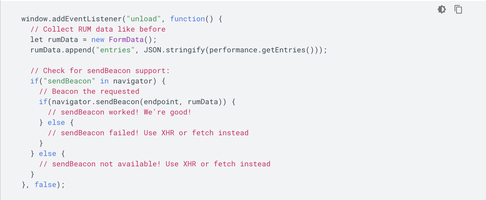

# 数据监控

Web 数据监控可以分为两大类：

- 合成监控（非侵入）：合成监控是采用 Web 浏览器模拟器来加载网页，通过模拟终端用户可能的操作来采集对应的性能指标，最后输出一个网站性能报告。
- 真是用户监控（侵入式）：真实用户监控是一种被动监控技术，是一种应用服务，被监控的 Web 应用通过 SDK 等方式接入该服务，将真实的用户访问、交互等性能指标数据收集上报、通过数据清洗加工后形成性能分析报表。

| 类型     | 优点                                                           | 缺点                                                                                                                           | 示例                    |
| -------- | -------------------------------------------------------------- | ------------------------------------------------------------------------------------------------------------------------------ | ----------------------- |
| 非侵入式 | 指标齐全、客户端主动监测、竞品监控                             | 无法知道性能影响用户数、采样少容易失真、无法监控复杂应用与细分功能，例如：没法考虑到登录的情况，对于需要登录的页面就无法监控到 | Lighthouse、WebPageTest |
| 侵入式   | 真实海量用户数据、能监控复杂应用与业务功能、用户点击与区域渲染 | 需插入脚本统计、网络指标不全、无法监控竞品                                                                                     | OneAPM、Datadog         |

# 打造自己的监控系统

虽然已经有了很多优秀的第三方监控系统，但是有时候我们也会面对打造自己监控系统的需求，可能是因为成本、安全、灵活性等等。

数据监控主要有以下几步：

1. 数据收集与上报
2. 数据存储与处理
3. 数据聚合和分析

# 收集与上报

## 数据收集

**基本性能数据**

将 performance navagation timing 中的所有点都上报，其余的上报内容可参考 performance 分析一节中截取部分上报。例如：白屏时间，JS 和 CSS 总数，以及加载总时长。

**异常数据上报**

- js error：监听 window 的 error 事件
- promise reject 的异常：监听 window 的 unhandledrejection 事件
- 资源加载失败：同样监听 window 的 error 事件，或者资源本身的 error 事件
- 网络请求失败：重写 window.XMLHttpRequest 和 window.fetch 捕获请求错误
- iframe 异常：监听 window.frames[0].onerror
- window.console.error

## 何时上报

数据上报有一个比较值得考虑的事情，那就是如何上报数据。

- 页面加载和重新刷新
- 页面切换路由
- 页面所在的 tab 标签重新变得可见

## 如何上报

一般会想到用 ajax 或者 fetch 来做，但是它们有两个主要的问题：

1. 跨域问题：一般日志服务器和业务服务器是分开的，所以不符合同域条件
2. 请求中断：浏览器通常会忽略在 unload 事件处理器中产生的异步请求

有一些其它方法可以帮助我们避免上述问题，但是由于兼容性问题，我们需要封装一个方法。当不满足条件时，我们需要做降级处理。

除了 ajax 以外我们还可以采用：

1. 动态创建 image 标签
2. 使用 navigator.sendBeacon 方法

Google 开发者推荐的上报方式，见下图。

# 存储与处理

一个用户访问，可能会上报几十条数据，每条数据都是多维度的。即：当前访问时间、平台、网络、ip 等。

这些一条条的数据都会被存储到数据库中，然后通过数据分析与聚合，提炼出有意义的数据。

例如：某日所有用户的平均访问时长、pv 等。

# 聚合和分析

数据统计分析的方法：平均值统计法、百分位数统计法、样本分布统计法。

数据最终可以使用 Echarts 这类图表来展示，便于观察与分析。

---

参考：
- [前端数据之美 -- 基础篇](http://fex.baidu.com/blog/2014/05/front_end-data/)
- [7 天打造前端性能监控系统](http://fex.baidu.com/blog/2014/05/build-performance-monitor-in-7-days/)
- [如何进行 web 性能监控？](http://www.alloyteam.com/2020/01/14184/)
- [Measure performance with the RAIL model](https://web.dev/rail/)
- [Performance](https://developer.mozilla.org/en-US/docs/Web/API/Performance)
