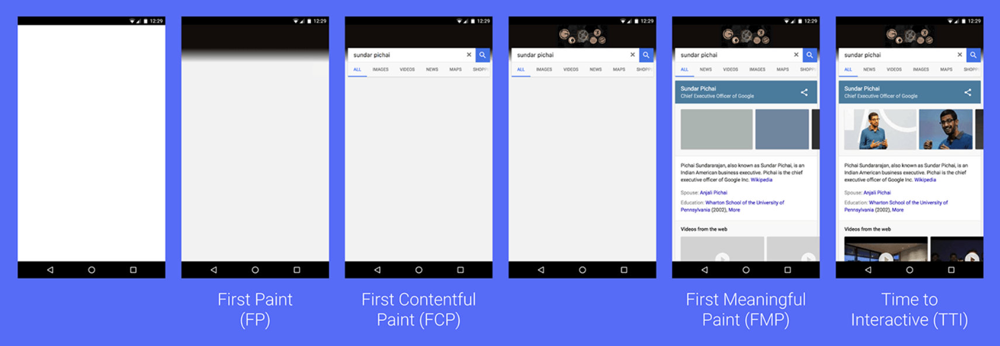
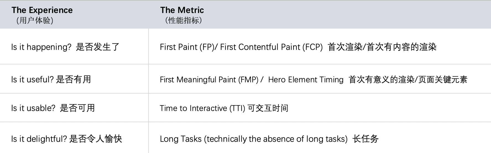
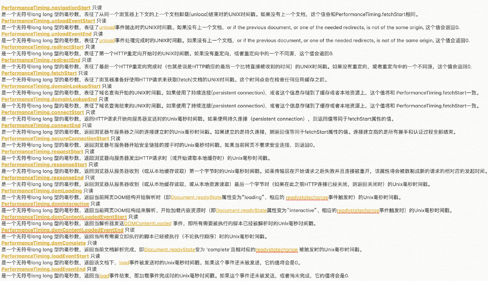
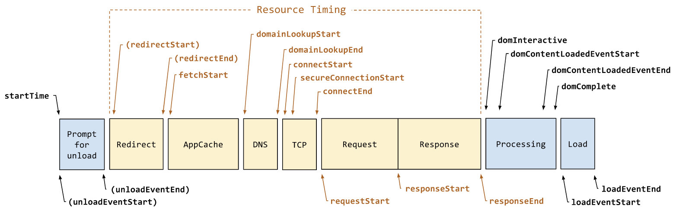

# 为什么要进行性能优化

随着时代的发展，互联网产品不再仅仅关注功能的有无，产品的体验也越来越重要了。

对于公司来说，性能在一定程度上与利益直接相关。

国外很多公司做过一些研究，数据如下：

| 性能                       | 收益                |
| -------------------------- | ------------------- |
| Google 延迟 400ms          | 搜索量下降 0.59%    |
| Bing 延迟 2s               | 收入下降 4.3%       |
| Yahoo 延迟 400ms           | 流量下降 5-9%       |
| Mozilla 页面打开减少 2.2s  | 下载量提升 15.4%    |
| Netflix 开启 Gzip 性能提升 | 13.25% 带宽减少 50% |

> Google DoubleClick 研究表明：如果一个移动端页面加载时长超过 3 秒，用户就会放弃而离开。BBC 发现网页加载时长每增加 1 秒，用户就会流失 10%。

如果我们做的是一个 To C 的产品，性能引发的问题将会相当严重。

# RAIL 模型

RAIL 是一种以用户为中心的性能模型，它提供了一种考虑性能的结构。 该模型将用户体验分解为关键操作（例如，点击、滚动、加载），并帮助您为每个操作定义性能目标。

RAIL 代表 Web 应用程序生命周期的四个不同方面：响应（Response）、动画（Animation）、空闲（Idle）和加载（Load）。 用户对这些上下文中的每一个都有不同的性能期望，因此性能目标是基于上下文和用户如何感知延迟的 UX 研究来定义的。

其指出最好的性能指标是：

- 100ms 内响应用户输入
- 动画或者滚动需在 10ms 内产生下一帧
- 最大化空闲时间
- 页面加载时长不超过 5 秒

了解了上边的模型和性能指标，我们要监控什么大致可以为以下几点：

- 页面响应速度：页面初始访问速度 + 交互响应速度
- 页面稳定性：页面出错率
- 外部服务调用：网络请求访问速度

## 页面响应速度

页面响应在实际的项目中，我们可以转为页面首次加载速度和交互响应速度。



我们先来看张图，来分析下用户打卡某个网页时的心里。



- FP（First Paint）：首次渲染，浏览器将第一个像素呈现到屏幕的时间。
- FCP（First Contentful Paint）：测量在用户导航到您的页面后浏览器呈现第一段 DOM 内容所的时间。 页面上的图像、非白色 `<canvas>` 元素和 SVG 被视为 DOM 内容； 不包括 iframe 内的任何内容。
- FMP（First Meaningful Paint）：衡量页面的主要内容何时对用户可见。 其本质上显示了绘制的时间，在此之后最大的首屏布局更改发生。
- TTI（Time to Interactive）：衡量一个页面需要多长时间才能完全交互。
- Long Tasks：浏览器是单线程的，如果长任务过多，那必然会影响用户的响应时长。

谷歌在 [Web Vitals](https://web.dev/learn-web-vitals/) 上提出了最新最重要的几个性能测量指标。
- LCP（Largest Contentful Paint）：测量视口中最大的内容元素何时呈现到屏幕上。 这大约是页面的主要内容对用户可见的时间。
- FID（First Input Delay）：首次输入延迟。
- CLS（Cumulative Layout Shift）：累计布局偏移。
- TBT（Total Blocking Time）：总阻塞时间。

## 页面稳定性

页面稳定性指的是页面出错情况，主要包括：

- 资源加载错误
- JS 执行报错

## 外部调用

指一些外部资源的请求情况，主要包括：

- CGI 耗时
- CGI 成功率
- CDN 资源耗时

# Performance

Performance 接口可以获取到当前页面中与性能相关的信息。它是 High Resolution Time API 的一部分，同时也融合了：
- Performance Timeline API：定义了 Performance 接口的扩展，以支持应用程序内的客户端延迟测量。
- Navigation Timing API：提供可用于衡量网站性能的数据。
- User Timing API：允许开发人员创建应用程序特定的时间戳，这些时间戳是浏览器性能时间线的一部分。
- Resource Timing API：支持检索和分析有关应用程序资源加载的详细网络计时数据。

简而言之，之前分散的几个接口，现在被融合了，通过 window.performance 可以访问所有的属性和方法。

基本属性：

- performance.navigation: 页面是加载还是刷新、发生了多少次重定向
- performance.timing: 页面加载的各阶段时长
- ~~performance.memory: 基本内存使用情况，Chrome 添加的一个非标准扩展~~
- performance.timeorigin: 性能测量开始时的时间的高精度时间戳

其中 performance.timing 内容较多，这里给出该对象的详细说明，见下图。



基本方法：

- performance.getEntries(): 通过这个方法可以获取到所有的 performance 实体对象。
- performance.getEntriesByName() \ performance.getEntriesByType(): 可对所有的 performance 实体对象进行过滤，返回特定类型的实体。
- performance.mark() \ performance.measure() : mark 方法和 measure 方法的结合可打点计时，获取某个函数执行耗时等。
- performance.now()：返回一个表示从性能测量时刻开始经过的毫秒数。

更多：[performance-timeline-2](https://www.w3.org/TR/performance-timeline-2/)

## 页面加载

主要关于页面整个加载和渲染周期各阶段的时间。



据此，我们可以得到一些指标的计算方法：

- 重定向次数：performance.navigation.redirectCount
- 重定向耗时：redirectEnd - redirectStart
- DNS 解析耗时：domainLookupEnd - domainLookupStart
- TCP 连接耗时：connectEnd - connectStart
- SSL 安全连接耗时：connectEnd - secureConnectionStart
- 网络请求耗时 (TTFB)：responseStart - requestStart
- 数据传输耗时：responseEnd - responseStart
- HTTP 头部大小：transferSize - encodedBodySize

以下几个指标比较重要：
- 白屏时间：domLoading - fetchStart
- DOM Ready 时间：domContentLoadEventEnd - fetchStart
- 页面完全加载时间：loadEventEnd - fetchStart

除此之外，可以使用 [PerformanceObserver](https://developer.mozilla.org/en-US/docs/Web/API/PerformanceObserver) 测量其它指标，如 FP 和 FCP：

```js
const observer = new PerformanceObserver(function(list) {
    const entries = list.getEntries()
    for (let i = 0; i < entries.length; i++) {
        if (entries[i].name === 'first-paint') {
            // 时长：entries[i].startTime ，如果要计算时刻 entries[i].startTime + performance.timeOrigin
        }
        if (entries[i].name === 'first-contentful-paint') {
            // 时长：entries[i].startTime ，如果要计算时刻 entries[i].startTime + performance.timeOrigin
        }
    }
})
observer.observe({
    entryTypes: ['paint']
})
```

[navigation-timing-2](https://www.w3.org/TR/navigation-timing-2/)

## 资源加载

主要关于页面各种资源的加载情况，比如 script、css、image、font 等等。


这个数据和 chrome 调式工具里 network 的瀑布图数据是一样的。

某类资源的加载时间，可测量图片、js、css、XHR：

```js
var resourceListEntries = window.performance.getEntriesByType('resource')
resourceListEntries.forEach((resource) => {
  if (resource.initiatorType == "img") {
    console.info(
      `Time taken to load ${resource.name}: `,
      resource.responseEnd - resource.startTime
    );
  }
});
```

[resource-timing-2](https://www.w3.org/TR/resource-timing-2/)
