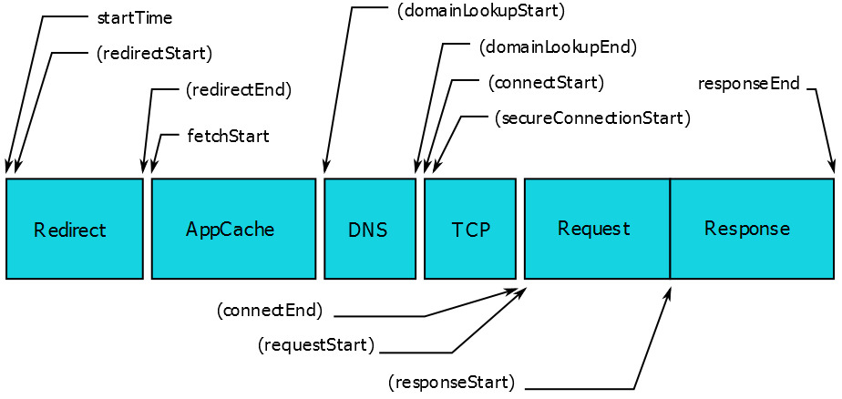
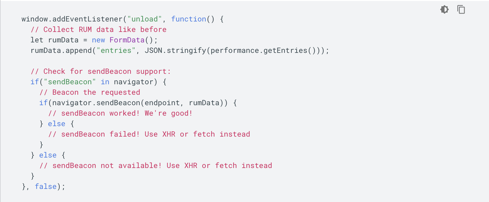

# 为什么要进行性能优化

随着时代的发展，互联网产品不再仅仅关注功能的有无，产品的体验也越来越重要了。

对于公司来说，性能在一定程度上与利益直接相关。

国外很多公司做过一些研究，数据如下：

| 性能                       | 收益                |
| -------------------------- | ------------------- |
| Google 延迟 400ms          | 搜索量下降 0.59%    |
| Bing 延迟 2s               | 收入下降 4.3%       |
| Yahoo 延迟 400ms           | 流量下降 5-9%       |
| Mozilla 页面打开减少 2.2s  | 下载量提升 15.4%    |
| Netflix 开启 Gzip 性能提升 | 13.25% 带宽减少 50% |

> Google DoubleClick 研究表明：如果一个移动端页面加载时长超过 3 秒，用户就会放弃而离开。BBC 发现网页加载时长每增加 1 秒，用户就会流失 10%。

如果我们做的是一个 To C 的产品，性能引发的问题将会相当严重。

# 前端数据

很多从业人员开始探索用户体验，大多数人是从感性的角度去分析，但作为一名程序员，我们可能更信服数据。

那如何用数据去衡量产品体验的好坏呢？前端的数据很多很杂，为了便于理解和分析，大致可以分为以下几类：

1. 访问：PV/UV、页面来源、操作系统、浏览器、分辨率、网络类型等。
2. 性能：白屏时间、首屏时间、用户可操作时间等。
3. 点击：页面总点击量、人均点击量、点击热力图等。
4. 异常：异常的提示信息、JS 文件名、异常所在行、发生异常的浏览器、堆栈信息等。
5. 其他：可以根据实际情况来定义统计需求，如用户浏览器对 canvas 的支持程度等。

本文主要关注前端性能，所以重点介绍下性能相关的内容。

## RAIL 模型

RAIL 是一种以用户为中心的性能模型，它提供了一种考虑性能的结构。 该模型将用户体验分解为关键操作（例如，点击、滚动、加载），并帮助您为每个操作定义性能目标。

RAIL 代表 Web 应用程序生命周期的四个不同方面：响应（Response）、动画（Animation）、空闲（Idle）和加载（Load）。 用户对这些上下文中的每一个都有不同的性能期望，因此性能目标是基于上下文和用户如何感知延迟的 UX 研究来定义的。

其指出最好的性能指标是：

- 100ms 内响应用户输入
- 动画或者滚动需在 10ms 内产生下一帧
- 最大化空闲时间
- 页面加载时长不超过 5 秒

了解了上边的模型和性能指标，我们要监控什么大致可以为以下几点：

- 响应速度：页面初始访问速度 + 交互响应速度
- 页面稳定性：页面出错率
- 外部服务调用：网络请求访问速度

## 响应速度

响应在实际的项目中，我们可以转为页面首次加载速度和交互响应速度。

我们先来看张图，来分析下用户打卡某个网页时的心里。


- FCP（First Contentful Paint）：测量在用户导航到您的页面后浏览器呈现第一段 DOM 内容所的时间。 页面上的图像、非白色 `<canvas>` 元素和 SVG 被视为 DOM 内容； 不包括 iframe 内的任何内容。
- FMP（First Meaningful Paint）：衡量页面的主要内容何时对用户可见。 其本质上显示了绘制的时间，在此之后最大的首屏布局更改发生。**目前该指标已被谷歌废弃，改用 LCP。**
- LCP（Largest Contentful Paint）：测量视口中最大的内容元素何时呈现到屏幕上。 这大约是页面的主要内容对用户可见的时间。
- TTI（Time to Interactive）：衡量一个页面需要多长时间才能完全交互。

## 页面稳定性

页面稳定性指的是页面出错情况，主要包括：

- 资源加载错误、JS 执行报错
- 异常监控

## 外部调用

指一些外部资源的请求情况，主要包括：

- CGI 耗时
- CGI 成功率
- CDN 资源耗时

# Performance

Performance 接口可以获取到当前页面中与性能相关的信息。它是 High Resolution Time API 的一部分，同时也融合了 Performance Timeline API、Navigation Timing API、 User Timing API 和 Resource Timing API。

该类型的对象可以通过调用只读属性 window.performance 来获得。

基本属性：

- performance.navigation: 页面是加载还是刷新、发生了多少次重定向
- performance.timing: 页面加载的各阶段时长
- performance.memory: 基本内存使用情况，Chrome 添加的一个非标准扩展
- performance.timeorigin: 性能测量开始时的时间的高精度时间戳

其中 performance.timing 内容较多，这里给出该对象的详细说明，见下图。


基本方法：

- performance.getEntries(): 通过这个方法可以获取到所有的 performance 实体对象。
- performance.getEntriesByName() \ performance.getEntriesByType(): 可对所有的 performance 实体对象进行过滤，返回特定类型的实体。
- performance.mark() \ performance.measure() : mark 方法和 measure 方法的结合可打点计时，获取某个函数执行耗时等。
- performance.now()：返回一个表示从性能测量时刻开始经过的毫秒数。

## 页面加载

主要关于页面整个加载和渲染周期各阶段的时间。


据此，我们可以得到一些指标的计算方法：

- 重定向次数：performance.navigation.redirectCount
- 重定向耗时: redirectEnd - redirectStart
- DNS 解析耗时: domainLookupEnd - domainLookupStart
- TCP 连接耗时: connectEnd - connectStart
- SSL 安全连接耗时: connectEnd - secureConnectionStart
- 网络请求耗时 (TTFB): responseStart - requestStart
- 数据传输耗时: responseEnd - responseStart
- DOM 解析耗时: domInteractive - responseEnd
- 资源加载耗时: loadEventStart - domContentLoadedEventEnd
- 首包时间: responseStart - domainLookupStart
- 白屏时间: responseEnd - fetchStart
- 首次可交互时间: domInteractive - fetchStart
- DOM Ready 时间: domContentLoadEventEnd - fetchStart
- 页面完全加载时间: loadEventStart - fetchStart
- HTTP 头部大小：transferSize - encodedBodySize

[navigation-timing](https://w3c.github.io/navigation-timing/)

## 资源加载

主要关于页面各种资源的加载情况，比如 script、css、image、font 等等。



这个数据和 chrome 调式工具里 network 的瀑布图数据是一样的。

某类资源的加载时间，可测量图片、js、css、XHR：

```js
resourceListEntries.forEach((resource) => {
  if (resource.initiatorType == "img") {
    console.info(
      `Time taken to load ${resource.name}: `,
      resource.responseEnd - resource.startTime
    );
  }
});
```

[resource-timing-2](https://www.w3.org/TR/resource-timing-2/)

# 数据监控

前面我们提到了一些关键数据，接下来要做的事情就是收集这些数据了。

Web 数据监控可以分为两大类：

- 合成监控（非侵入）：合成监控是采用 Web 浏览器模拟器来加载网页，通过模拟终端用户可能的操作来采集对应的性能指标，最后输出一个网站性能报告。
- 真是用户监控（侵入式）：真实用户监控是一种被动监控技术，是一种应用服务，被监控的 Web 应用通过 SDK 等方式接入该服务，将真实的用户访问、交互等性能指标数据收集上报、通过数据清洗加工后形成性能分析报表。

| 类型     | 优点                                                           | 缺点                                                                                                                           | 示例                    |
| -------- | -------------------------------------------------------------- | ------------------------------------------------------------------------------------------------------------------------------ | ----------------------- |
| 非侵入式 | 指标齐全、客户端主动监测、竞品监控                             | 无法知道性能影响用户数、采样少容易失真、无法监控复杂应用与细分功能，例如：没法考虑到登录的情况，对于需要登录的页面就无法监控到 | Lighthouse、WebPageTest |
| 侵入式   | 真实海量用户数据、能监控复杂应用与业务功能、用户点击与区域渲染 | 需插入脚本统计、网络指标不全、无法监控竞品                                                                                     | OneAPM、Datadog         |

# 打造自己的监控系统

虽然已经有了很多优秀的第三方监控系统，但是有时候我们也会面对打造自己监控系统的需求，可能是因为成本、安全、灵活性等等。

数据监控主要有以下几步：

1. 数据收集与上报
2. 数据存储与处理
3. 数据聚合和分析

## 收集与上报

**数据收集**

- 基本性能数：将 performance navagation timing 中的所有点都上报，其余的上报内容可参考 performance 分析一节中截取部分上报。例如：白屏时间，JS 和 CSS 总数，以及加载总时长。
- 异常数据上报
    - js error：监听 window 的 error 事件
    - promise reject 的异常：监听 window 的 unhandledrejection 事件
    - 资源加载失败：同样监听 window 的 error 事件，或者资源本身的 error 事件
    - 网络请求失败：重写 window.XMLHttpRequest 和 window.fetch 捕获请求错误
    - iframe 异常：监听 window.frames[0].onerror
    - window.console.error

**何时上报**

- 页面加载和重新刷新
- 页面切换路由
- 页面所在的 tab 标签重新变得可见

**如何上报**

一般会想到用 ajax 或者 fetch 来做，但是它们有两个主要的问题：

1. 跨域问题：一般日志服务器和业务服务器是分开的，所以不符合同域条件
2. 请求中断：浏览器通常会忽略在 unload 事件处理器中产生的异步请求

有一些其它方法可以帮助我们避免上述问题，但是由于兼容性问题，我们需要封装一个方法。当不满足条件时，我们需要做降级处理。

除了 ajax 以外我们还可以采用：

1. 动态创建 image 标签
2. 使用 navigator.sendBeacon 方法

Google 开发者推荐的上报方式，见下图。



## 存储与处理

一个用户访问，可能会上报几十条数据，每条数据都是多维度的。即：当前访问时间、平台、网络、ip 等。

这些一条条的数据都会被存储到数据库中，然后通过数据分析与聚合，提炼出有意义的数据。

例如：某日所有用户的平均访问时长、pv 等。

## 聚合和分析

数据统计分析的方法：平均值统计法、百分位数统计法、样本分布统计法。

数据最终可以使用 Echarts 这类图表来展示，便于观察与分析。

---

参考：
- [前端数据之美 -- 基础篇](http://fex.baidu.com/blog/2014/05/front_end-data/)
- [7 天打造前端性能监控系统](http://fex.baidu.com/blog/2014/05/build-performance-monitor-in-7-days/)
- [如何进行 web 性能监控？](http://www.alloyteam.com/2020/01/14184/)
- [Measure performance with the RAIL model](https://web.dev/rail/)
- [Performance](https://developer.mozilla.org/en-US/docs/Web/API/Performance)
