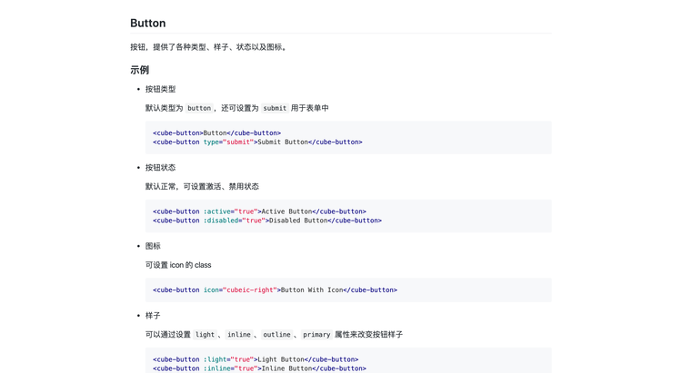

前端工程构建，当前最火的工具应该就是 Webpack 了。除了掌握其基本的配置外，学习如何编写 Webpack loaders 和 plugins 也十分重要，这可以帮助我们解决很多实际问题，提升工作效率。

# Loaders

Webpack 允许使用加载程序预处理文件。这允许您以 JavaScript 之外的方式捆绑任何静态资源。

按博主的理解，Loader 就是一个翻译，可以将任何其他类型的文件翻译成 JavaScript，供 Webpack 识别打包。

编写一个 Loader 不难，本节会介绍编写 Loaders 的基本知识，最后带您编写一个 Loader，将 .md 转为 .vue 组件。

## 基础知识

Loaders 分为四种类型：

-   Synchronous Loaders：同步 Loaders
-   Asynchronous Loaders：异步 Loaders
-   "Raw" Loader：原始 Loaders，这种 Loaders 接收的不是字符串，而是原始的 buffer 数据
-   Pitching Loader：通常多个 Loaders 放在一起，它们的执行顺序是从右到左，而这种类型的 Loader 执行是从左到右

由于后面两种 Loaders 并不常见，我们这里主要介绍下同步 Loaders 和异步 Loaders。

Loaders 本质上是一个 js 文件，使用 node.js 编写。

```js
/**
 *
 * @param {string|Buffer} content Content of the resource file
 * @param {object} [map] SourceMap data consumable by https://github.com/mozilla/source-map
 * @param {any} [meta] Meta data, could be anything
 */
function webpackLoader(content, map, meta) {
    // code of your webpack loader
}
```

`content` 需要了解，它就是其他类型文件的文本或 buffer。在方法里，我们可以根据需求对内容进行加工处理，最后再返回。

**同步 Loaders**

同步 Loaders 有两种写法，一种是直接返回结果，另一种是通过调用 callback 方法返回结果。

相比于直接返回结果，使用 callback 方法更加灵活，并且可以传递多个参数。

```js
module.exports = function (content, map, meta) {
    return someSyncOperation(content);
};
```

```js
module.exports = function (content, map, meta) {
    this.callback(null, someSyncOperation(content), map, meta);
    return; // always return undefined when calling callback()
};
```

**异步 Loaders**

异步 Loaders 也有两种写法，一种针对单个输出，另一种针对多个输出。

```js
module.exports = function (content, map, meta) {
    var callback = this.async();
    someAsyncOperation(content, function (err, result) {
        if (err) return callback(err);
        callback(null, result, map, meta);
    });
};
```

```js
module.exports = function (content, map, meta) {
    var callback = this.async();
    someAsyncOperation(content, function (err, result, sourceMaps, meta) {
        if (err) return callback(err);
        callback(null, result, sourceMaps, meta);
    });
};
```

## 实战案例

聊完了基础知识，可能很难有一个感性的认识。现在，我们通过一个实际案例，来看看如何应用 webpack loaders。

loaders 功能：将 .md 文件转为 .vue 组件。

```md
## Button

按钮，提供了各种类型、样子、状态以及图标。

### 示例

-   按钮类型

    默认类型为 `button`，还可设置为 `submit` 用于表单中

    ```html
    <cube-button>Button</cube-button>
    <cube-button type="submit">Submit Button</cube-button>
    ```

-   按钮状态

    默认正常，可设置激活、禁用状态

    ```html
    <cube-button :active="true">Active Button</cube-button>
    <cube-button :disabled="true">Disabled Button</cube-button>
    ```

-   图标

    可设置 icon 的 class

    ```html
    <cube-button icon="cubeic-right">Button With Icon</cube-button>
    ```

-   样子

    可以通过设置 `light`、`inline`、`outline`、`primary` 属性来改变按钮样子

    ```html
    <cube-button :light="true">Light Button</cube-button>
    <cube-button :inline="true">Inline Button</cube-button>
    <cube-button :outline="true">Outline Button</cube-button>
    <cube-button :primary="true">Primary Button</cube-button>
    ```

### Props 配置

| 参数     | 说明      | 类型    | 可选值           | 默认值 |
| -------- | --------- | ------- | ---------------- | ------ |
| type     | 按钮类型  | String  | button/submit    | button |
| active   | 激活状态  | Boolean | true/false       | false  |
| disabled | 禁用状态  | Boolean | true/false       | false  |
| icon     | 图表 Icon | String  | icon 的 class 值 | -      |
| light    | 亮色      | Boolean | true/false       | false  |
| inline   | 是否内联  | Boolean | true/false       | false  |
| outline  | 外边框    | Boolean | true/false       | false  |
| primary  | 主要的    | Boolean | true/false       | false  |

### 事件

| 事件名 | 说明                                         | 参数         |
| ------ | -------------------------------------------- | ------------ |
| click  | 点击按钮后触发此事件，如果禁用状态，则不触发 | e - 事件对象 |

```

我们需要把上面这份 md 转化成一个 vue 组件来渲染。

在该功能的实现中需要用到三个工具包：

- markdown-it：解析 markdown 文件，将其转换成 html 标签
- highlight.js：高亮代码块
- github-markdown-css：高亮普通标签，如 h1、h2、p 等

新建一个文件 `vue-md-loader.js`，里面添加以下内容：

```js
const MarkdownIt = require('markdown-it')
const hljs = require('highlight.js');

module.exports = function(source) {
  const md = new MarkdownIt({
    highlight: function(str, lang) {
      if (lang && hljs.getLanguage(lang)) {
        try {
          return '<pre class="hljs"><code>' +
            hljs.highlight(lang, str, true).value +
            '</code></pre>';
        } catch (__) {}
      }

      return '<pre class="hljs"><code>' + md.utils.escapeHtml(str) + '</code></pre>';
    }
  })
  let res = md.render(source)
  res = `<template><div>${res}</div></template>`

  return res
}
```

通过上面那个 loader，我们已经将 md 文件转换成了 vue 单文件组件的格式，但是还不能直接被 vue 引入，需要经过 vue-loader 解析。

我们只需要在 webpack.config.js 中进行如下配置：

```js
const path = require("path");
const VueLoaderPlugin = require("vue-loader/lib/plugin");

module.exports = {
    mode: "development",
    entry: "./src/main.js",
    module: {
        rules: [
            {
                test: /\.css$/,
                loader: ["style-loader", "css-loader"],
            },
            {
                test: /\.vue$/,
                loader: "vue-loader",
            },
            {
                test: /\.md$/,
                loader: ["vue-loader", "./loader/vue-md-loader.js"],
            },
        ],
    },
    plugins: [new VueLoaderPlugin()],
    output: {
        path: path.resolve(__dirname, "dist"),
        filename: "[name].js",
    },
};
```

上面两步做完后，我们就可以在 App.vue 中把 md 文件当 vue 组件引入了。

```vue
<template lang="html">
    <div class="markdown-body">
        <zh-button></zh-button>
    </div>
</template>

<script>
import button from "./md/button.md";
import "github-markdown-css";
import "highlight.js/styles/github.css";

export default {
    components: {
        ZhButton: button,
    },
};
</script>

<style lang="css" scoped>
.markdown-body {
    box-sizing: border-box;
    min-width: 200px;
    max-width: 980px;
    margin: 0 auto;
    padding: 45px;
}
</style>
```

由于我们引入的 github 的样式，所以最终的效果和你在 github 上看 readme.md 是一样的。



# Plugins

插件是 webpack 生态系统中的一个关键部分，它为社区提供了一种强大的方式来利用 webpack 的编译过程。

插件能够钩住在每次编译过程中触发的关键事件。

在这个过程中的每一步，插件都将拥有对编译器的完全访问权限，并且在适用的情况下，还可以访问当前的编译。

简单来说，插件给我们提供了一个机会，可以入侵 webpack 的编译过程，在期间搞一些事情。

## 基础知识

一个 webpack 插件由以下几部分组成：

-   命名的 JavaScript 函数或 JavaScript 类。
-   在其原型中定义 apply 方法。
-   指定要利用的事件挂钩。
-   操作 webpack 内部实例特定数据。
-   在功能完成后调用 webpack 提供的回调。

```js
// A JavaScript class.
class MyExampleWebpackPlugin {
    // Define `apply` as its prototype method which is supplied with compiler as its argument
    apply(compiler) {
        // Specify the event hook to attach to
        compiler.hooks.emit.tapAsync(
            "MyExampleWebpackPlugin",
            (compilation, callback) => {
                console.log("This is an example plugin!");
                console.log(
                    "Here’s the `compilation` object which represents a single build of assets:",
                    compilation
                );

                // Manipulate the build using the plugin API provided by webpack
                compilation.addModule(/* ... */);

                callback();
            }
        );
    }
}
```

其实 webpack 中的插件本质上是一个类。我们在使用插件时，一般需要实例化一个对象，然后传入插件数组中。

当 webpack 执行时，会调用每个插件实例的 apply 方法。这个方法可以接受一个参数 compiler，通过它我们可以拿到 webpack 本次打包的信息，同时可以访问打包的整个生命流程。

通过一些 hook，我们可以在整个打包流程中插入我们自定义的内容。这些 hook 有同步和异步之分，我们在编写插件时需要注意。

**Compiler 和 Compilation**

Compiler 和 Compilation 是两个十分重要的概念，如果我们要编写 webpack 插件，一定要搞清楚它们之间的区别。

> Compiler

Compiler 对象是 webpack 的编译器对象，compiler 对象会在启动 webpack 的时候被一次性的初始化，compiler 对象中包含了所有 webpack 可自定义操作的配置，例如 loader 的配置，plugin 的配置，entry 的配置等各种原始 webpack 配置等，在 webpack 插件中的自定义子编译流程中，我们肯定会用到 compiler 对象中的相关配置信息，我们相当于可以通过 compiler 对象拿到 webpack 的主环境所有的信息。

> Compilation

说明 Compilation 之前，首先需要了解一下什么是编译资源。编译资源是 webpack 通过配置生成的一份静态资源管理 Map（一切都在内存中保存），以 key-value 的形式描述一个 webpack 打包后的文件，编译资源就是这一个个 key-value 组成的 Map。而编译资源就是由 compilation 对象生成的。

Compilation 实例继承于 compiler，compilation 对象代表了一次单一的版本 webpack 构建和生成编译资源的过程。当运行 webpack 开发环境中间件时，每当检测到一个文件变化，一次新的编译将被创建，从而生成一组新的编译资源以及新的 compilation 对象。一个 compilation 对象包含了 当前的模块资源、编译生成资源、变化的文件、以及被跟踪依赖的状态信息。编译对象也提供了很多关键点回调供插件做自定义处理时选择使用。

由此可见，如果开发者需要通过一个插件的方式完成一个自定义的编译工作的话，**如果涉及到需要改变编译后的资源产物，必定离不开这个 compilation 对象**。

如果需要了解 compiler 和 compilation 对象的详情，可以通过在插件中 console.log(compilation) 的方式进行查看对象所包含的内容，然而如果还想了解的更加透彻的话，看源码是一个非常好的途径，将会使你对 webpack 的认识更加深刻。

**Synchronous Hooks 和 Asynchronous Hooks**

hooks event 主要有两种，同步和异步。一般来说，如果是异步的 event，基本上同步和异步都支持，使用哪一种根据具体情况来定。

> Synchronous Hooks

同步 hooks 主要分为三种：

-   SyncHook：Tapped into using tap method.
-   Bail Hooks：Tapped into using tap method.
-   Waterfall Hooks：Tapped into using tap method.

> Asynchronous Hooks

异步 hooks 主要分为四种：

-   Async Series Hook：Tapped into using tap/tapAsync/tapPromise method.
-   Async waterfall：Tapped into using tap/tapAsync/tapPromise method.
-   Async Series Bail：Tapped into using tap/tapAsync/tapPromise method.
-   Async Parallel：Tapped into using tap/tapAsync/tapPromise method.

**Webpack 插件相关的事件钩子**

如果我们要想通过 webpack 插件去实现我们的需求，那么了解 Webpack 插件相关的事件钩子就十分关键了。

老实说，Webpack 事件钩子函数太多了，及时看了文档也不太可能里面立马理解，最好的办法是一个个试下。

前面介绍了 Compiler 和 Compilation，它们有各自的钩子函数，这里会介绍一些常用的事件钩子函数及其含义。

> Compiler

| 事件钩子     | 触发时机                                            | 得到的内容       | 类型              |
| ------------ | --------------------------------------------------- | ---------------- | ----------------- |
| entryOption  | 初始化 option                                       | -                | SyncBailHook      |
| run          | 开始编译                                            | compiler         | AsyncSeriesHook   |
| compile      | 真正开始的编译，在创建 compilation 对象之前         | compilation 参数 | SyncHook          |
| compilation  | 生成好了 compilation 对象，可以操作这个对象啦       | compilation      | SyncHook          |
| make         | 从 entry 开始递归分析依赖，准备对每个模块进行 build | compilation      | AsyncParallelHook |
| afterCompile | 编译 build 过程结束                                 | compliation      | AsyncSeriesHook   |
| emit         | 在将内存中 assets 内容写到磁盘文件夹之前            | compilation      | AsyncSeriesHook   |
| afterEmit    | 在将内存中 assets 内容写到磁盘文件夹之后            | compilation      | AsyncSeriesHook   |
| done         | 完成所有的编译过程                                  | stats            | AsyncSeriesHook   |
| failed       | 编译失败的时候                                      | error            | SyncHook          |

> Compilation

| 事件钩子            | 触发时机                                                                                                   | 类型            |
| ------------------- | ---------------------------------------------------------------------------------------------------------- | --------------- |
| seal                | 编译的封闭已经开始，这个时候再也收不到任何的模块了，进入编译封闭阶段（参考 webpack 流程图）。              | SyncHook        |
| optimize            | 优化编译，这个事件钩子特别重要，很多插件的优化工作都是基于这个事件钩子，表示 webpack 已经进入优化阶段。    | SyncHook        |
| optimizeModules     | 模块的优化                                                                                                 | SyncBailHook    |
| optimizeChunks      | 这是个重要的事件钩子，webpack 的 chunk 优化阶段。可以拿到模块的依赖，loader 等，并进行相应的处理。         | SyncBailHook    |
| additionalAssets    | 在这个阶段可以为 compilation 对象创建额外的 assets，可以异步的在最后的产物中加入自己自定义的一些资源。     | AsyncSeriesHook |
| optimizeChunkAssets | 优化 chunk 的 assets 的事件钩子，这个优化阶段可以改变 chunk 的 assets 以达到重新改变资源内容的目。         | AsyncSeriesHook |
| optimizeAssets      | 优化所有的 assets 的异步事件钩子，在这个阶段可以直接通过 this.assets 拿到所有的 assets，并进行自定义操作。 | AsyncSeriesHook |

## 实战案例

这里我们编写一个简单的插件。主要的功能时在打包结束后，在输出目录加个 license.txt 文件，其中写些打包信息。

```js
module.exports = class LicensePlugin {
    apply(compiler) {
        compiler.hooks.emit.tapAsync(
            "LicensePlugin",
            (compilation, callback) => {
                const currentTime = new Date();
                const str =
                    currentTime.getFullYear() +
                    "-" +
                    (currentTime.getMonth() + 1) +
                    "-" +
                    currentTime.getDate() +
                    " build by ZhouLei";

                compilation.assets["license.txt"] = {
                    source() {
                        return str;
                    },

                    size() {
                        return str.length;
                    },
                };
                callback();
            }
        );
    }
};
```

参考：

-   [Loader Interface](https://webpack.js.org/api/loaders/)
-   [Writing a Loader](https://webpack.js.org/contribute/writing-a-loader/)
-   [vue-markdown-loader](https://github.com/QingWei-Li/vue-markdown-loader)
-   [Plugin API](https://webpack.js.org/api/plugins/)
-   [Writing a Plugin](https://webpack.js.org/contribute/writing-a-plugin/)
-   [看清楚真正的 Webpack 插件](https://zoumiaojiang.com/article/what-is-real-webpack-plugin/)
